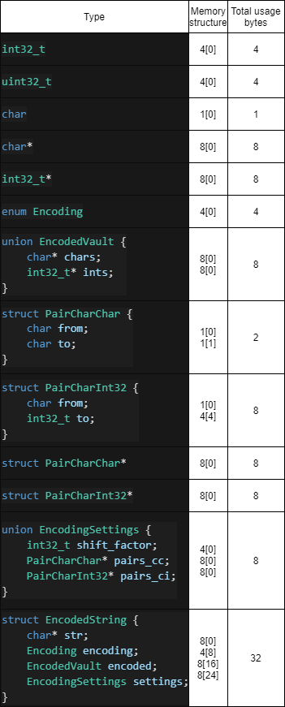
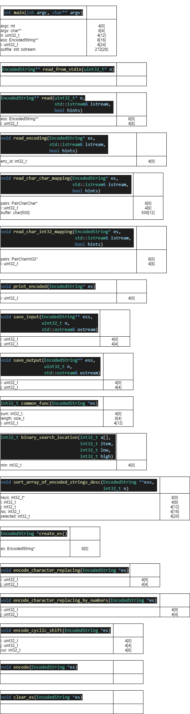
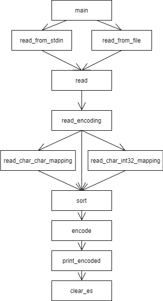

Вариант задания 219.

Номер условия задачи: (219 - 1) mod 14 + 1 = 9

Номер дополнительной функции: ((219 - 1) div 14) mod 25 + 1 = 16

# Условия

## Начальные условия задачи

### Обобщенный артефакт, используемый в задании

Тексты, состоящие из цифр и латинских букв, зашифрованные различными способами.

### Базовые альтернативы (уникальные параметры, задающие отличительные признаки альтернатив)

1. Шифрование заменой символов (указатель на массив пар: [текущий символ, замещающий символ]; зашифрованный текст – строка символов)
2. Шифрование циклическим сдвигом кода каждого символа на n (целое число, определяющее сдвиг; зашифрованный текст – строка символов)
3. Шифрование заменой символов на числа (пары: текущий символ, целое число – подстановка при шифровании кода символа в виде короткого целого; зашифрованный текст – целочисленный массив)

### Общие для всех альтернатив переменные

Открытый текст – строка символов.

### Общие для всех альтернатив функции

Частное от деления суммы кодов незашифрованной строки на число символов в этой строке (действительное число)

## Дополнительная функция

Упорядочить элементы контейнера по убыванию используя сортировку методом деления пополам (Binary Insertion). В качестве ключей для сортировки и других действий используются результаты функции, общей для всех альтернатив

# Описание программы

Программа получает на вход количество строк (размер контейнера), затем для каждой строки считывает тип кодировки и настройки кодировки. Затем сортирует контейнер по ключу (дополнительная функция) и выводит в порядке убывания ключа зашифрованные строки. Входные данные считываются из `stdin` или из файла. Если программа запускается без аргументов, ожидается пользовательский ввод, показываются подсказки для пользователя (программа выводит их в `stderr`, тем самым не захламляет `stdout`, в котором только конечный ответ) (вообще говоря, это не всегда хорошо, но в данном случае, я считаю, приемлимо, так как падение программы и "настоящего" `stderr` не предусмотрено).

# Пример выходного файла

```
Total strings: 5
#,string,encoding,settings
0,abcde,Shift,1
1,bcdef,Char-char,HIJKLMNO0123cdefghijklmnopqrstuvwxyzABCDEFGPQRSTUVWXYZ456789ab
2,cdefg,Shift,4
3,defgh,Char-int32,0 1 2 3 4 5 0 1 2 3 4 5 0 1 2 3 4 5 0 1 2 3 4 5 0 1 2 3 4 5 0 1 2 3 4 5 0 1 2 3 4 5 0 1 2 3 4 5 0 1 2 3 4 5 0 1 2 3 4 5 0 1
4,efghi,Shift,-5

Sorted output:
#,string,encoded
0,efghi,9abcd
1,defgh,1 2 3 4 5
2,cdefg,ghijk
3,bcdef,3cdef
4,abcde,bcdef
```

# Тесты + время выполнения программы

Добавлено в общей сумме 10 тестов, которые покрывают все виды кодировок, а также проверяют правильность сортировки. Тесты лежат в директории `tests`.

- `0_*.in` -- проверка на невалидные данные
- `1_*.in` -- проверка шифрования заменой символов на символы
- `2_*.in` -- проверка шифрования циклическим сдвигом
- `3_*.in` -- проверка шифрования заменой символов на целые числа
- `4_*.in` -- проверка работы сортировки

Все тесты проходятся. Запуск тестирования через `/bin/sh run_tests.sh` (запускает программу, выводит в файл, затем сравнивает реальный вывод с правильным) или же `make test` (запускает `run_tests.sh`).

Вывод `./run_tests.sh`

```
➜  lab1 git:(master) ✗ ./run_tests.sh
Test ./tests/0_1.in succeeded. Time elapsed: 3122118 nanos
Test ./tests/1_1.in succeeded. Time elapsed: 3094995 nanos
Test ./tests/1_2.in succeeded. Time elapsed: 2662561 nanos
Test ./tests/1_3.in succeeded. Time elapsed: 2859980 nanos
Test ./tests/2_1.in succeeded. Time elapsed: 2561097 nanos
Test ./tests/2_2.in succeeded. Time elapsed: 2488556 nanos
Test ./tests/2_3.in succeeded. Time elapsed: 2505265 nanos
Test ./tests/3_1.in succeeded. Time elapsed: 2400389 nanos
Test ./tests/3_2.in succeeded. Time elapsed: 2468610 nanos
Test ./tests/4_1.in succeeded. Time elapsed: 2329275 nanos
```

# Бенчмарки и генерация случайных данных

Скрипт для запуска бенчмарков: `make benchmark && ./bin/app_benchmark.out`.

Ниже представлен один из результатов бенчмарка на `x86_64 Intel Xeon Processor (Icelake) 12 cores 2 GHz`.

```
Sort of      50 string:          5675 nanoseconds
Sort of     100 string:          9073 nanoseconds
Sort of     500 string:        113410 nanoseconds
Sort of    1000 string:        260080 nanoseconds
Sort of    5000 string:       5471082 nanoseconds
Sort of   10000 string:      21745607 nanoseconds
Sort of   50000 string:     539900507 nanoseconds
Char-char encoding of string with length  50:   4067 nanoseconds
Char-char encoding of string with length 100:   7204 nanoseconds
Char-char encoding of string with length 200:   7295 nanoseconds
Char-char encoding of string with length 300:  11044 nanoseconds
Char-char encoding of string with length 400:  14668 nanoseconds
Char-char encoding of string with length 499:  18546 nanoseconds
Char-int32 encoding of string with length  50:   2008 nanoseconds
Char-int32 encoding of string with length 100:   3317 nanoseconds
Char-int32 encoding of string with length 200:   6865 nanoseconds
Char-int32 encoding of string with length 300:  10593 nanoseconds
Char-int32 encoding of string with length 400:  14717 nanoseconds
Char-int32 encoding of string with length 499:  19140 nanoseconds
Cyclic shift encoding of string with length  50:   2122 nanoseconds
Cyclic shift encoding of string with length 100:   3755 nanoseconds
Cyclic shift encoding of string with length 200:   8107 nanoseconds
Cyclic shift encoding of string with length 300:  12515 nanoseconds
Cyclic shift encoding of string with length 400:  16487 nanoseconds
Cyclic shift encoding of string with length 499:  21286 nanoseconds
```

# Структура данных

```cpp
struct EncodedString {
    char* str;  // decoded
    Encoding encoding; // enum

    union EncodedVault {
        char* chars;
        int32_t* ints;
    } encoded;

    union EncodingSettings {
        int32_t shift_factor;
        struct PairCharChar {
            char from;
            char to;
        } * pairs_char_char;
        struct PairCharInt32 {
            char from;
            int32_t to;
        } * pairs_char_int32;
    } encoding_settings;
};
```

Структура универсальная для каждой альтернативы, за счет `union` полей. Содержит указатель на исходную строку; `enum` типов кодировок; `union` поле для результата (либо массив `char`, либо массив `int32`); `union` поле с настройками (либо ширина сдвига, либо mapping массив). Размер всей структры 32 байта. При использовании шифрования строки методом циклического сдвига, 4 байта лишние, это единственный минус такого решения. Объявлены 3 функции в `.h` файле, а именно создание структуры `EncodedString* create_es();` с первоначальным выделением памяти (не всей, а только 32 байта + буффер для задания первоначальной строки, так как она есть у всех альтернатив), очищение памяти `void clear_es(EncodedString* es);`, а также функция `void encode(EncodedString* es);`, которая реализует методы зашифровки исходной строки в зависимости от настроек.

# Таблица типов



# Таблица памяти функций



На куче лежат массивы исходных, зашифрованных строк, настройки шифрования (кроме сдвига), а также сам контейнер.

# Стек вызовов



# Декомпозиция + размер кода

Исходный код программы находится в директории `src`. Файлы:

- `benchmark.cpp` (4518 bytes) - точка входа для выполнения бенчмарков
- `main.cpp` (1321 bytes) - точка входа основной программы
- `encoded_string.h` (877 bytes) - структура и заголовки функций
- `encoded_string.cpp` (2495 bytes) - реализация функций для структуры
- `io.h` (460 bytes) - заголовки функций для ввода-вывода
- `io.cpp` (5588 bytes) - реализация ввода-вывода
- `sort.h` (180 bytes) - заголовки функций сортировки и вычисления ключа для нее
- `sort.cpp` (1225 bytes) - реализация функций сортировки и вычисления ключа для нее

Размер файлов брался из вывода `ls -l`.

# Сборка

Сборка осуществляется через вызов `make`, который создает необходимые `.o` файлы для последующей линковки, а также сам исполняемый файл `app.out` в директории `bin`.

Также есть специальные `rules`:

- `make clean` - очистит папку `bin/`
- `make debug` - скомпилирует программу с дополнительными флагами `-fsanitize=address -g`
- `make benchmark` - скомпилирует модуль для проведения бенчмарков `app_benchmark.out`
- `make test` - алиас запуска `run_tests.sh`
