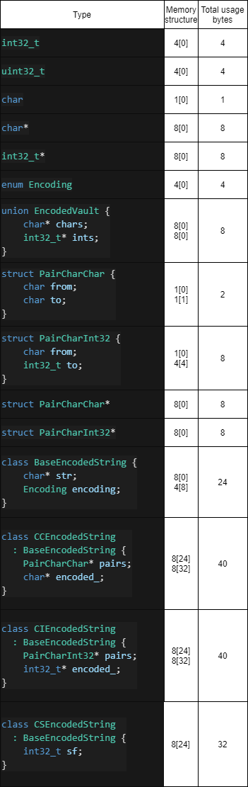
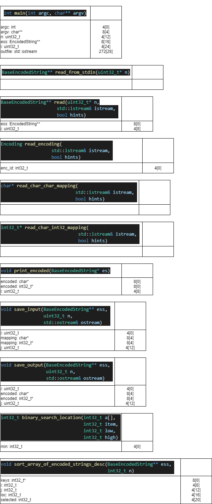
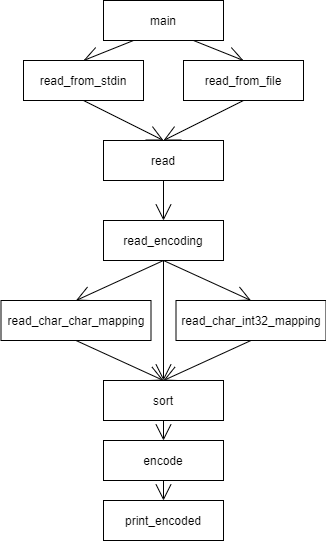

# Содержание

- [Вариант](#вариант)
- [Условия](#условия)
- [Описание программы](#описание-программы)
- [Пример выходного файла](#пример-выходного-файла)
- [Тесты + время выполнения программы](#тесты--время-выполнения-программы)
- [Бенчмарки и генерация случайных данных](#бенчмарки-и-генерация-случайных-данных)
- [Структуры данных](#структуры-данных)
- [Таблица типов](#таблица-типов)
- [Таблица памяти функций](#таблица-памяти-функций)
- [Стек вызовов](#стек-вызовов)
- [Декомпозиция + размер кода](#декомпозиция--размер-кода)
- [Сборка](#сборка)
- [Сравнение с предыдущими версиями](#сравнение-с-предыдущими-версиями)

# Вариант

Вариант задания 219.

Номер условия задачи: (219 - 1) mod 14 + 1 = 9

Номер дополнительной функции: ((219 - 1) div 14) mod 25 + 1 = 16

# Условия

## Начальные условия задачи

### Обобщенный артефакт, используемый в задании

Тексты, состоящие из цифр и латинских букв, зашифрованные различными способами.

### Базовые альтернативы (уникальные параметры, задающие отличительные признаки альтернатив)

1. Шифрование заменой символов (указатель на массив пар: [текущий символ, замещающий символ]; зашифрованный текст – строка символов)
2. Шифрование циклическим сдвигом кода каждого символа на n (целое число, определяющее сдвиг; зашифрованный текст – строка символов)
3. Шифрование заменой символов на числа (пары: текущий символ, целое число – подстановка при шифровании кода символа в виде короткого целого; зашифрованный текст – целочисленный массив)

### Общие для всех альтернатив переменные

Открытый текст – строка символов.

### Общие для всех альтернатив функции

Частное от деления суммы кодов незашифрованной строки на число символов в этой строке (действительное число)

## Дополнительная функция

Упорядочить элементы контейнера по убыванию используя сортировку методом деления пополам (Binary Insertion). В качестве ключей для сортировки и других действий используются результаты функции, общей для всех альтернатив

# Описание программы

Программа получает на вход количество строк (размер контейнера), затем для каждой строки считывает тип кодировки и настройки кодировки. Затем сортирует контейнер по ключу (дополнительная функция) и выводит в порядке убывания ключа зашифрованные строки. Входные данные считываются из `stdin` или из файла. Если программа запускается без аргументов, ожидается пользовательский ввод, показываются подсказки для пользователя (программа выводит их в `stderr`, тем самым не захламляет `stdout`, в котором только конечный ответ) (вообще говоря, это не всегда хорошо, но в данном случае, я считаю, приемлимо, так как падение программы и "настоящего" `stderr` не предусмотрено).

# Пример выходного файла

```
Total strings: 5
#,string,encoding,settings
0,abcde,Shift,1
1,bcdef,Char-char,HIJKLMNO0123cdefghijklmnopqrstuvwxyzABCDEFGPQRSTUVWXYZ456789ab
2,cdefg,Shift,4
3,defgh,Char-int32,0 1 2 3 4 5 0 1 2 3 4 5 0 1 2 3 4 5 0 1 2 3 4 5 0 1 2 3 4 5 0 1 2 3 4 5 0 1 2 3 4 5 0 1 2 3 4 5 0 1 2 3 4 5 0 1 2 3 4 5 0 1
4,efghi,Shift,-5

Sorted output:
#,string,encoded
0,efghi,9abcd
1,defgh,1 2 3 4 5
2,cdefg,ghijk
3,bcdef,3cdef
4,abcde,bcdef
```

# Тесты + время выполнения программы

Добавлено в общей сумме 10 тестов, которые покрывают все виды кодировок, а также проверяют правильность сортировки. Тесты лежат в директории `tests`.

- `0_*.in` -- проверка на невалидные данные
- `1_*.in` -- проверка шифрования заменой символов на символы
- `2_*.in` -- проверка шифрования циклическим сдвигом
- `3_*.in` -- проверка шифрования заменой символов на целые числа
- `4_*.in` -- проверка работы сортировки

Все тесты проходятся. Запуск тестирования через `/bin/sh run_tests.sh` (запускает программу, выводит в файл, затем сравнивает реальный вывод с правильным) или же `make test` (запускает `run_tests.sh`).

Вывод `./run_tests.sh`

```
➜  lab1 git:(master) ✗ ./run_tests.sh
Test ./tests/0_1.in succeeded. Time elapsed: 2967906 nanos
Test ./tests/1_1.in succeeded. Time elapsed: 2422697 nanos
Test ./tests/1_2.in succeeded. Time elapsed: 1945827 nanos
Test ./tests/1_3.in succeeded. Time elapsed: 2307325 nanos
Test ./tests/2_1.in succeeded. Time elapsed: 1940531 nanos
Test ./tests/2_2.in succeeded. Time elapsed: 1927211 nanos
Test ./tests/2_3.in succeeded. Time elapsed: 2306727 nanos
Test ./tests/3_1.in succeeded. Time elapsed: 2435582 nanos
Test ./tests/3_2.in succeeded. Time elapsed: 2002326 nanos
Test ./tests/4_1.in succeeded. Time elapsed: 1890587 nanos
```

# Бенчмарки и генерация случайных данных

Скрипт для запуска бенчмарков: `make benchmark && ./bin/app_benchmark.out`.

Ниже представлено среднее арифметическое из 4 результатов бенчмарка на `x86_64 Intel Xeon Processor (Icelake) 12 cores 2 GHz`.

```
Sort of      50 string:          4820 nanoseconds
Sort of     100 string:          9922 nanoseconds
Sort of     500 string:         82958 nanoseconds
Sort of    1000 string:        281253 nanoseconds
Sort of    5000 string:       5481048 nanoseconds
Sort of   10000 string:      21648542 nanoseconds
Sort of   50000 string:     535286841 nanoseconds

Char-char,    length  50: 3308   nanoseconds
Char-char,    length 100: 3097   nanoseconds
Char-char,    length 200: 3381   nanoseconds
Char-char,    length 300: 3012   nanoseconds
Char-char,    length 400: 3297   nanoseconds
Char-char,    length 499: 2883   nanoseconds
Char-int32,   length  50: 3323   nanoseconds
Char-int32,   length 100: 7131   nanoseconds
Char-int32,   length 200: 15154  nanoseconds
Char-int32,   length 300: 21479  nanoseconds
Char-int32,   length 400: 28639  nanoseconds
Char-int32,   length 499: 35069  nanoseconds
Cyclic shift, length  50: 3306   nanoseconds
Cyclic shift, length 100: 6099   nanoseconds
Cyclic shift, length 200: 14345  nanoseconds
Cyclic shift, length 300: 22431  nanoseconds
Cyclic shift, length 400: 25179  nanoseconds
Cyclic shift, length 499: 25932  nanoseconds
```

# Структуры данных

В этой лабораторной работе было сделано 4 класса, 1 из которых базовый абстрактный класс.

Базовый класс:

```cpp
class BaseEncodedString {
private:
    char* str;  // decoded

public:
    Encoding encoding;
    BaseEncodedString(char* decoded, Encoding enc);
    void base_clear(); // чистит поле str
    char* decoded(); // getter
    int32_t common_func(); // функция для сортировки встроена в базовый класс
    virtual void encode() = 0; // метод должен быть определен
    virtual ~BaseEncodedString(){}; // деструктор должен быть у классов наследников
};
```

3 класса-наследника:

```cpp
// char char pairing
class CCEncodedString : public BaseEncodedString {
public:
    struct PairCharChar {
        char from;
        char to;
    };
    PairCharChar* mapping();
    CCEncodedString(char* decoded, char* alphabet_mapping);
    void encode();
    char* encoded();
    ~CCEncodedString();

private:
    PairCharChar* pairs;
    char* encoded_;
};

// char int32 pairing
class CIEncodedString : public BaseEncodedString {
public:
    struct PairCharInt32 {
        char from;
        int32_t to;
    };
    PairCharInt32* mapping();
    CIEncodedString(char* decoded, int32_t* alphabet_mapping);
    void encode();
    int32_t* encoded();
    ~CIEncodedString();

private:
    PairCharInt32* pairs;
    int32_t* encoded_;
};

// char shift
class CSEncodedString : public BaseEncodedString {
public:
    int32_t shift_factor();
    CSEncodedString(char* decoded, int32_t sf);
    void encode();
    char* encoded();
    ~CSEncodedString();

private:
    int32_t shift_factor_;
    char* encoded_;
};
```

У каждого из 3 классов наследников свои конструктор и деструктор, свой метод шифрования и свой метод на получение зашифрованной строки. В сравнении с предыдущей реализацией, здесь немного отличается процесс инициализации.

Пришлось добавить некоторые публичные методы, чтобы иметь возможность получать информацию о том, какие настройки шифрования установлены в том или ином типе.

`BaseEncodedString` весит 24 байта, `CCEncodedString` и `CIEncodedString` по 40 байт, `CSEncodedString` - 32 байта.

# Таблица типов



# Таблица памяти функций



На куче лежат массивы исходных, зашифрованных строк, настройки шифрования (кроме сдвига), а также сам контейнер.

# Стек вызовов



# Декомпозиция + размер кода

Исходный код программы находится в директории `src`. Файлы:
4018+1631+566+6338+149+1009+(464+635+971+427+982+443+890+340)

- `benchmark.cpp` (4018 bytes) - точка входа для выполнения бенчмарков
- `main.cpp` (1312 bytes) - точка входа основной программы
- `io.h` (566 bytes) - заголовки функций для ввода-вывода
- `io.cpp` (6338 bytes) - реализация ввода-вывода
- `sort.h` (149 bytes) - заголовки функций сортировки и вычисления ключа для нее
- `sort.cpp` (1009 bytes) - реализация функций сортировки и вычисления ключа для нее
- `encoded_string` (5152 bytes) - папка, содержащая 8 файлов, 4 хедера с классами и 4 файла с реализацией методов классов
- `base.cpp` (464 bytes)
- `base.h` (635 bytes)
- `cc_string.cpp` (971 bytes)
- `cc_string.h` (427 bytes)
- `ci_string.cpp` (982 bytes)
- `ci_string.h` (443 bytes)
- `cs_string.cpp` (890 bytes)
- `cs_string.h` (340 bytes)

Размер файлов брался из вывода `ls -l`. Суммарный размер файлов 18544 байт. Размер исполняемого файла: 40584 байт.

# Сборка

Сборка осуществляется через вызов `make`, который создает необходимые `.o` файлы для последующей линковки, а также сам исполняемый файл `app.out` в директории `bin`.

Также есть специальные `rules`:

- `make clean` - очистит папку `bin/`
- `make debug` - скомпилирует программу с дополнительными флагами `-fsanitize=address -g`
- `make benchmark` - скомпилирует модуль для проведения бенчмарков `app_benchmark.out`
- `make test` - алиас запуска `run_tests.sh`

# Сравнение с предыдущими версиями

Сравнение среднего из 4 бенчмарков текущей лабораторной со средним из 4 бенчмарков предыдущей

Сортировка

| Кол-во строк | lab1 (nanos) | lab2 (nanos) |
| ------------ | ------------ | ------------ |
| 50           | 6105         | 4820         |
| 100          | 12599        | 9922         |
| 500          | 90130        | 82958        |
| 1000         | 275552       | 281253       |
| 5000         | 5334398      | 5481048      |
| 10000        | 21566482     | 21648542     |
| 50000        | 532103793    | 535286841    |

Шифрование `char-char`

| Длина строки | lab1 (nanos) | lab2 (nanos) |
| ------------ | ------------ | ------------ |
| 50           | 2794         | 3308         |
| 100          | 4896         | 3097         |
| 200          | 10987        | 3381         |
| 300          | 12977        | 3012         |
| 400          | 17025        | 3297         |
| 499          | 21667        | 2883         |

Шифрование `char-int32`

| Длина строки | lab1 (nanos) | lab2 (nanos) |
| ------------ | ------------ | ------------ |
| 50           | 2118         | 3323         |
| 100          | 3944         | 7131         |
| 200          | 8090         | 15154        |
| 300          | 12186        | 21479        |
| 400          | 17827        | 28639        |
| 499          | 24924        | 35069        |

Шифрование `cyclic shift`

| Длина строки | lab1 (nanos) | lab2 (nanos) |
| ------------ | ------------ | ------------ |
| 50           | 2310         | 3306         |
| 100          | 4398         | 6099         |
| 200          | 10284        | 14345        |
| 300          | 14971        | 22431        |
| 400          | 20373        | 25179        |
| 499          | 25612        | 25932        |
