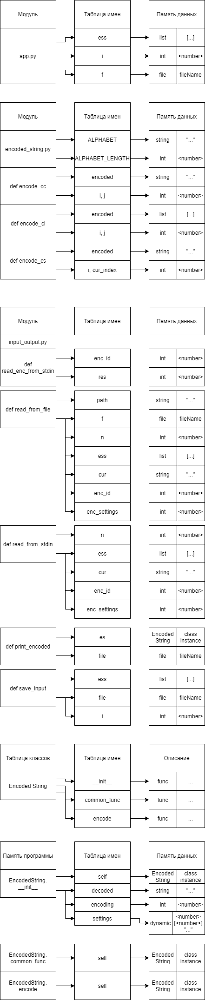

# Содержание

- [Вариант](#вариант)
- [Условия](#условия)
- [Описание программы](#описание-программы)
- [Пример выходного файла](#пример-выходного-файла)
- [Тесты + время выполнения программы](#тесты--время-выполнения-программы)
- [Бенчмарки и генерация случайных данных](#бенчмарки-и-генерация-случайных-данных)
- [Структуры данных](#структуры-данных)
- [Таблица типов + таблица памяти](#таблица-типов,таблица-памяти)
- [Декомпозиция + размер кода](#декомпозиция--размер-кода)
- [Сборка](#сборка)
- [Сравнение с предыдущими версиями](#сравнение-с-предыдущими-версиями)

# Вариант

Вариант задания 219.

Номер условия задачи: (219 - 1) mod 14 + 1 = 9

Номер дополнительной функции: ((219 - 1) div 14) mod 25 + 1 = 16

# Условия

## Начальные условия задачи

### Обобщенный артефакт, используемый в задании

Тексты, состоящие из цифр и латинских букв, зашифрованные различными способами.

### Базовые альтернативы (уникальные параметры, задающие отличительные признаки альтернатив)

1. Шифрование заменой символов (указатель на массив пар: [текущий символ, замещающий символ]; зашифрованный текст – строка символов)
2. Шифрование циклическим сдвигом кода каждого символа на n (целое число, определяющее сдвиг; зашифрованный текст – строка символов)
3. Шифрование заменой символов на числа (пары: текущий символ, целое число – подстановка при шифровании кода символа в виде короткого целого; зашифрованный текст – целочисленный массив)

### Общие для всех альтернатив переменные

Открытый текст – строка символов.

### Общие для всех альтернатив функции

Частное от деления суммы кодов незашифрованной строки на число символов в этой строке (действительное число)

## Дополнительная функция

Упорядочить элементы контейнера по убыванию используя сортировку методом деления пополам (Binary Insertion). В качестве ключей для сортировки и других действий используются результаты функции, общей для всех альтернатив

# Описание программы

Программа получает на вход количество строк (размер контейнера), затем для каждой строки считывает тип кодировки и настройки кодировки. Затем сортирует контейнер по ключу (дополнительная функция) и выводит в порядке убывания ключа зашифрованные строки. Входные данные считываются из `stdin` или из файла. Если программа запускается без аргументов, ожидается пользовательский ввод, показываются подсказки для пользователя.

# Пример выходного файла

Файл дампа входных данных.

```
Total strings: 5
#,string,encoding,settings
0,abcde,Shift,1
1,bcdef,Char-char,HIJKLMNO0123cdefghijklmnopqrstuvwxyzABCDEFGPQRSTUVWXYZ456789ab
2,cdefg,Shift,4
3,defgh,Char-int32,0 1 2 3 4 5 0 1 2 3 4 5 0 1 2 3 4 5 0 1 2 3 4 5 0 1 2 3 4 5 0 1 2 3 4 5 0 1 2 3 4 5 0 1 2 3 4 5 0 1 2 3 4 5 0 1 2 3 4 5 0 1
4,efghi,Shift,-5
```

Выходной файл.

```
fghij
efghi
defgh
cdefg
bcdef
```

<!-- ```
Sorted output:
#,string,encoded
0,efghi,9abcd
1,defgh,1 2 3 4 5
2,cdefg,ghijk
3,bcdef,3cdef
4,abcde,bcdef
``` -->

# Тесты + время выполнения программы

Добавлено в общей сумме 10 тестов, которые покрывают все виды кодировок, а также проверяют правильность сортировки. Тесты лежат в директории `tests`.

- `0_*.in` -- проверка на невалидные данные
- `1_*.in` -- проверка шифрования заменой символов на символы
- `2_*.in` -- проверка шифрования циклическим сдвигом
- `3_*.in` -- проверка шифрования заменой символов на целые числа
- `4_*.in` -- проверка работы сортировки

Все тесты проходятся. Запуск тестирования через `/bin/sh run_tests.sh` (запускает программу, выводит в файл, затем сравнивает реальный вывод с правильным) или же `make test` (запускает `run_tests.sh`).

Вывод `./run_tests.sh`

```
➜  lab1 git:(master) ✗ ./run_tests.sh
Test ./tests/0_1.in succeeded. Time elapsed: 18785576 nanos
Test ./tests/1_1.in succeeded. Time elapsed: 16180889 nanos
Test ./tests/1_2.in succeeded. Time elapsed: 16343859 nanos
Test ./tests/1_3.in succeeded. Time elapsed: 16185768 nanos
Test ./tests/2_1.in succeeded. Time elapsed: 15834742 nanos
Test ./tests/2_2.in succeeded. Time elapsed: 16605845 nanos
Test ./tests/2_3.in succeeded. Time elapsed: 16341458 nanos
Test ./tests/3_1.in succeeded. Time elapsed: 16035882 nanos
Test ./tests/3_2.in succeeded. Time elapsed: 15940519 nanos
Test ./tests/4_1.in succeeded. Time elapsed: 16038207 nanos
```

# Бенчмарки и генерация случайных данных

Скрипт для запуска бенчмарков: `python3 src/benchmark.py`.

Ниже представлено среднее арифметическое из 4 результатов бенчмарка на `x86_64 Intel Xeon Processor (Icelake) 12 cores 2 GHz`.

```
Sort of 50 string: 4779 nanoseconds
Sort of 100 string: 6361 nanoseconds
Sort of 500 string: 8099 nanoseconds
Sort of 1000 string: 11299 nanoseconds
Sort of 5000 string: 11788 nanoseconds
Sort of 10000 string: 9909 nanoseconds
Sort of 50000 string: 12478 nanoseconds
Sort of 100000 string: 13051 nanoseconds
Sort of 200000 string: 14575 nanoseconds
Char-char encoding of string with length 50: 198766 nanoseconds
Char-char encoding of string with length 100: 386074 nanoseconds
Char-char encoding of string with length 200: 775598 nanoseconds
Char-char encoding of string with length 300: 1164760 nanoseconds
Char-char encoding of string with length 400: 1550571 nanoseconds
Char-char encoding of string with length 499: 1931462 nanoseconds
Char-int32 encoding of string with length 50: 193714 nanoseconds
Char-int32 encoding of string with length 100: 382953 nanoseconds
Char-int32 encoding of string with length 200: 769604 nanoseconds
Char-int32 encoding of string with length 300: 1145168 nanoseconds
Char-int32 encoding of string with length 400: 1542929 nanoseconds
Char-int32 encoding of string with length 499: 1924310 nanoseconds
Cyclic shift of string with length 50: 20818 nanoseconds
Cyclic shift of string with length 100: 24491 nanoseconds
Cyclic shift of string with length 200: 47352 nanoseconds
Cyclic shift of string with length 300: 71088 nanoseconds
Cyclic shift of string with length 400: 99998 nanoseconds
Cyclic shift of string with length 499: 119998 nanoseconds
```

# Структуры данных

В этой лабораторной работе был сделан 1 универсальный класс, который реализует все виды шифрования.

```py
class EncodedString: {
    def __init__(self, decoded, encoding, settings)
    def common_func(self)
    def encode(self)
}
```

В сравнении с предыдущими реализациями, кода намного меньше. Типизация динамическая.

# Таблица типов, таблица памяти



<!-- # Таблица памяти функций


На куче лежат массивы исходных, зашифрованных строк, настройки шифрования (кроме сдвига), а также сам контейнер.

# Стек вызовов

 -->

# Декомпозиция + размер кода

Исходный код программы находится в директории `src`. Файлы:
4018+1631+566+6338+149+1009+(464+635+971+427+982+443+890+340)

- `benchmark.py` (2562 bytes) - точка входа для выполнения бенчмарков
- `app.py` (1138 bytes) - точка входа основной программы
- `input_output.py` (3074 bytes) - заголовки функций для ввода-вывода
- `encoded_string.py` (1469 bytes) - папка, содержащая 8 файлов, 4 хедера с классами и 4 файла с реализацией методов классов

Размер файлов брался из вывода `ls -l`. Суммарный размер файлов 8243 байт.

# Сборка

На питоне сборки нет.

# Сравнение с предыдущими версиями

Сравнение среднего из 4 бенчмарков текущей лабораторной со средним из 4 бенчмарков предыдущей

Сортировка

| Кол-во строк | lab1 (nanos) | lab2 (nanos) | lab3 (nanos) |
| ------------ | ------------ | ------------ | ------------ |
| 50           | 6105         | 4820         | 4779         |
| 100          | 12599        | 9922         | 6361         |
| 500          | 90130        | 82958        | 8099         |
| 1000         | 275552       | 281253       | 11299        |
| 5000         | 5334398      | 5481048      | 11788        |
| 10000        | 21566482     | 21648542     | 9909         |
| 50000        | 532103793    | 535286841    | 12478        |
| 100000       | -            | -            | 13051        |
| 200000       | -            | -            | 14575        |

Шифрование `char-char`

| Длина строки | lab1 (nanos) | lab2 (nanos) | lab3 (nanos) |
| ------------ | ------------ | ------------ | ------------ |
| 50           | 2794         | 3308         | 198766       |
| 100          | 4896         | 3097         | 386074       |
| 200          | 10987        | 3381         | 775598       |
| 300          | 12977        | 3012         | 1164760      |
| 400          | 17025        | 3297         | 1550571      |
| 499          | 21667        | 2883         | 1931462      |

Шифрование `char-int32`

| Длина строки | lab1 (nanos) | lab2 (nanos) | lab3 (nanos) |
| ------------ | ------------ | ------------ | ------------ |
| 50           | 2118         | 3323         | 193714       |
| 100          | 3944         | 7131         | 382953       |
| 200          | 8090         | 15154        | 769604       |
| 300          | 12186        | 21479        | 1145168      |
| 400          | 17827        | 28639        | 1542929      |
| 499          | 24924        | 35069        | 1924310      |

Шифрование `cyclic shift`

| Длина строки | lab1 (nanos) | lab2 (nanos) | lab3 (nanos) |
| ------------ | ------------ | ------------ | ------------ |
| 50           | 2310         | 3306         | 20818        |
| 100          | 4398         | 6099         | 24491        |
| 200          | 10284        | 14345        | 47352        |
| 300          | 14971        | 22431        | 71088        |
| 400          | 20373        | 25179        | 99998        |
| 499          | 25612        | 25932        | 119998       |
